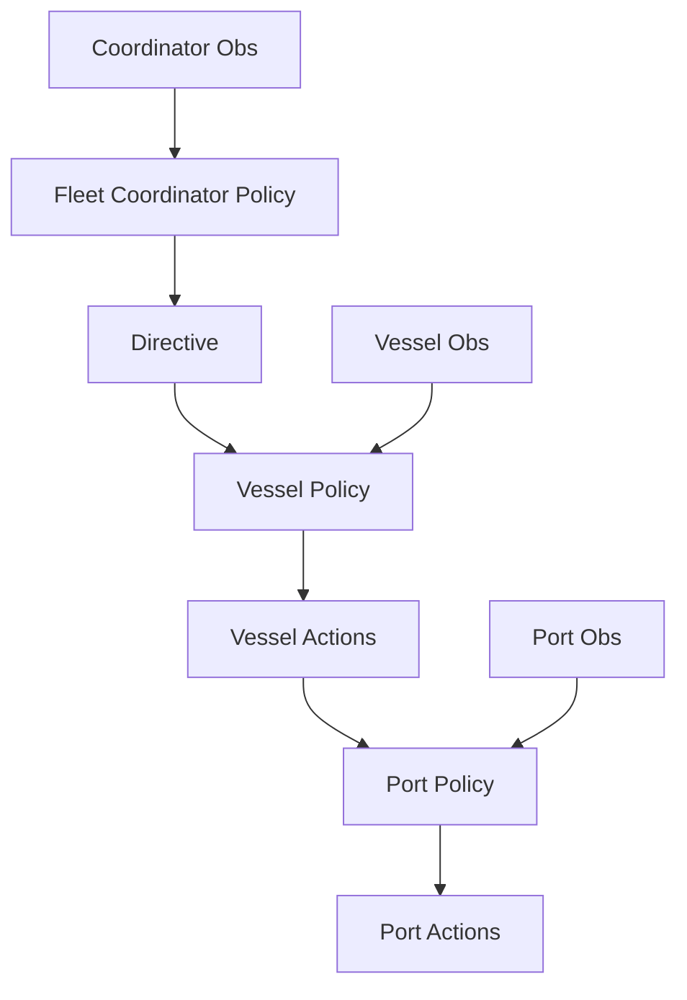

# Agent Input / Output Diagram

## Per-agent I/O schema

| Agent | Inputs | Outputs | Cadence (target) |
|------|--------|---------|------------------|
| Fleet Coordinator | Medium forecast, fleet summaries, cumulative emissions | Destination directive, departure window, emission budget | Every 12 steps |
| Vessel Agent | Coordinator directive, short forecast, vessel local state (location, speed, fuel, emissions, dock availability), sea state (if weather enabled) | Target speed, arrival-slot request | Every step |
| Port Agent | Queue/dock state, incoming requests, short forecast | Service rate, request acceptance, dock allocation | Every 2 steps |

## Dataflow diagram

## Current code mapping

1. Coordinator policy class and action proposal:
   `hmarl_mvp/policies.py::FleetCoordinatorPolicy.propose_action`
2. Vessel policy class and action proposal:
   `hmarl_mvp/policies.py::VesselPolicy.propose_action`
3. Port policy class and action proposal:
   `hmarl_mvp/policies.py::PortPolicy.propose_action`
4. Observation builders:
   `hmarl_mvp/env.py::_get_observations`
5. Latency-aware visible context before each step:
   `hmarl_mvp/env.py::MaritimeEnv.peek_step_context`
