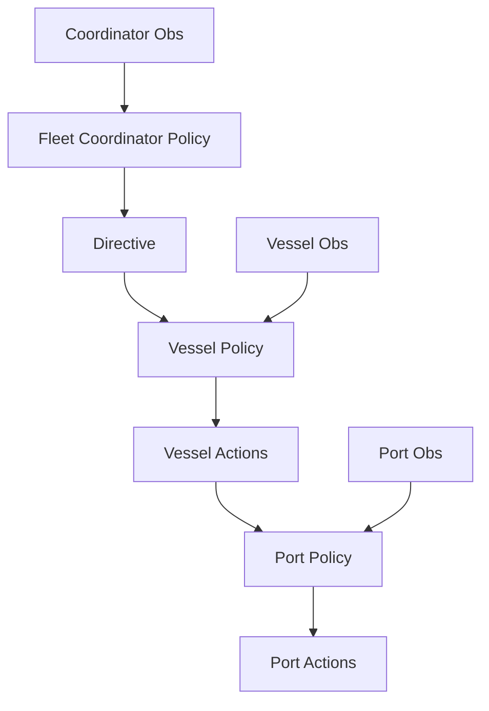

# Agent Input / Output Diagram

## Per-agent I/O schema

| Agent | Inputs | Outputs | Cadence (target) |
|------|--------|---------|------------------|
| Fleet Coordinator | Medium forecast (all ports, `num_ports × medium_horizon_days`), fleet summaries, cumulative emissions, weather matrix (if enabled) | Destination directive, departure window, emission budget | Every 12 steps |
| Vessel Agent | Coordinator directive, short forecast **for the assigned port** (see note), vessel local state (location, speed, fuel, emissions, dock availability), sea state (if weather enabled) | Target speed, arrival-slot request, requested arrival time | Every step |
| Port Agent | Queue/dock state, incoming requests, short forecast for own port | Service rate, request acceptance | Every 2 steps |

### Vessel short-forecast indexing

Each vessel receives a **single row** of the short-term forecast matrix:
`short[directive_dest_port]` — the congestion forecast for
the port currently assigned by the Fleet Coordinator.

- **At sea**: uses `vessel.destination` (the active navigation target).
- **Docked / pending**: uses `directive["dest_port"]` from the latest FC
  directive so the vessel observes the forecast for the port it *will*
  navigate to, even before departure.
- **FC reassignment**: the directive is updated at the next coordinator
  cadence step (every 12 steps by default). The vessel's forecast row
  switches on the following observation after the new directive is
  delivered. There is no mid-step inconsistency because directive
  delivery and observation building both happen within the same tick.
- **Providing all port forecasts** (i.e. `short.flatten()`) is a viable
  alternative and would let the vessel reason about all ports
  simultaneously. The current single-row design keeps observation size
  small (`short_horizon_hours` floats vs `num_ports × short_horizon_hours`).
  This trade-off can be revisited when scaling to larger fleets.

### Docks per port

Each port has **multiple docks** — the default is `docks_per_port = 3`
(configurable via `HMARLConfig.docks_per_port`). The experiment configs
use 3 docks for the 3-port baseline and 5 docks for the 8-port
full-scale runs. Port observations expose `docks` (total) and `occupied`
(in service), so agents can infer available capacity.

## Dataflow diagram

## Current code mapping

1. Coordinator policy class and action proposal:
   `hmarl_mvp/policies.py::FleetCoordinatorPolicy.propose_action`
2. Vessel policy class and action proposal:
   `hmarl_mvp/policies.py::VesselPolicy.propose_action`
3. Port policy class and action proposal:
   `hmarl_mvp/policies.py::PortPolicy.propose_action`
4. Observation builders:
   `hmarl_mvp/env.py::_get_observations`
5. Latency-aware visible context before each step:
   `hmarl_mvp/env.py::MaritimeEnv.peek_step_context`
