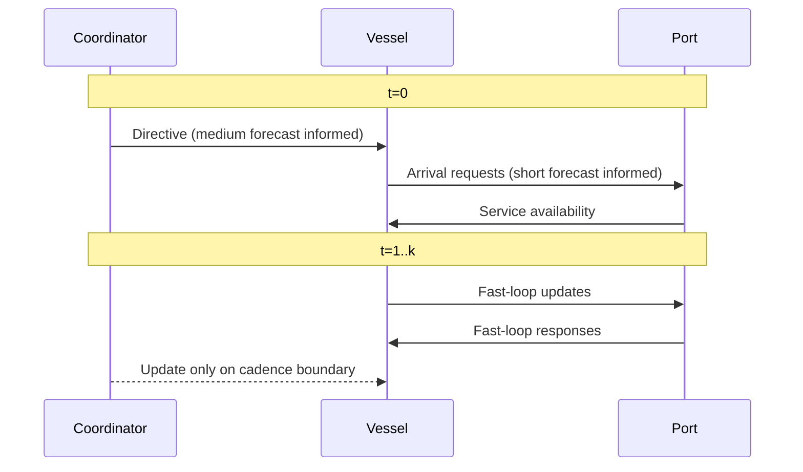

# Forecasting Horizons and Asynchronous Communication

## Horizon allocation

1. Coordinator:
   medium-term horizon (`medium_horizon_days`)
2. Vessel and Port:
   short-term horizon (`short_horizon_hours`)

## Asynchronous cadence model

The environment should support different decision rates per agent class:

- coordinator every `coord_decision_interval_steps`
- vessel every `vessel_decision_interval_steps`
- port every `port_decision_interval_steps`

Current config keys:

- `coord_decision_interval_steps`
- `vessel_decision_interval_steps`
- `port_decision_interval_steps`
- `message_latency_steps`

Code references:

- `hmarl_mvp/config.py`
- `hmarl_mvp/env.py`
- `hmarl_mvp/message_bus.py`

## Cadence diagram

## Implementation guidance

1. Cache last coordinator directive between coordinator update steps.
2. Timestamp messages with publish step and consume step.
3. Apply `message_latency_steps` before a receiver can consume messages.
4. Test cadence with deterministic seeds and fixed intervals.
