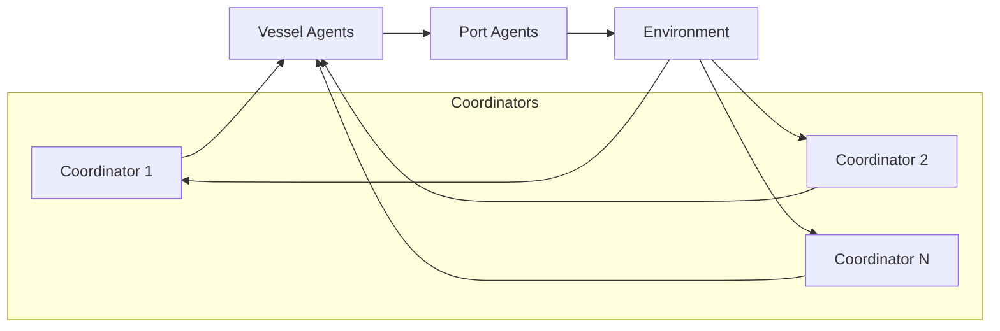

# Scaling to Multiple Coordinators

## Goal

Move from a single fleet coordinator to `N` coordinators without rewriting
core environment dynamics.

## Current scaffolding

Config:

- `num_coordinators` in `hmarl_mvp/config.py`

Utilities:

- `hmarl_mvp/multi_coordinator.py::assign_vessels_to_coordinators`
- `hmarl_mvp/multi_coordinator.py::build_multi_coordinator_directives`

## Initial partition strategy

1. Docked vessel:
   coordinator id = `location % num_coordinators`
2. In-transit vessel:
   coordinator id = `vessel_id % num_coordinators`

This is a baseline partitioning strategy to keep interfaces stable.

## Next upgrade path

1. Replace modulo partitioning with region/fleet ownership map.
2. Add coordinator-to-coordinator protocol for cross-region handoff.
3. Add conflict resolution when two coordinators target same port bottleneck.
4. Evaluate:
   - shared critic with coordinator id embedding
   - or hierarchical critics (local + global)

## Multi-coordinator dataflow

