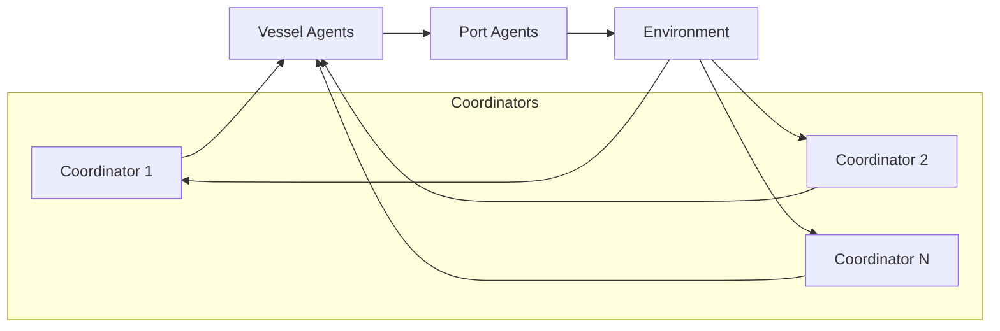

# Scaling to Multiple Coordinators

## Goal

Move from a single fleet coordinator to `N` coordinators without rewriting
core environment dynamics.

## Current scaffolding

Config:

- `num_coordinators` in `hmarl_mvp/config.py`

Utilities:

- `hmarl_mvp/agents.py::assign_vessels_to_coordinators`
- `hmarl_mvp/env.py::_build_assignments`

## Initial partition strategy

1. Docked vessel:
   coordinator id = `location % num_coordinators`
2. In-transit vessel:
   coordinator id = `vessel_id % num_coordinators`

This is a baseline partitioning strategy to keep interfaces stable.

## Next upgrade path

1. Replace modulo partitioning with region/fleet ownership map.
2. Add coordinator-to-coordinator protocol for cross-region handoff.
3. Add conflict resolution when two coordinators target same port bottleneck.
4. Evaluate:
   - shared critic with coordinator id embedding
   - or hierarchical critics (local + global)

## CTDE integration (implemented)

The MAPPO trainer (`mappo.py`) uses a **shared critic** that receives the
full global state regardless of the number of coordinators.  Each
coordinator runs its own decentralised actor while the centralised critic
fuses all coordinator, vessel, and port observations.  The global state
dimension is:

```
N_c × coordinator_obs_dim + N_v × vessel_obs_dim + N_p × port_obs_dim
+ N_p (congestion) + 1 (total_emissions)
```

See `mappo_ctde_training.md` for full details.

## Multi-coordinator dataflow


